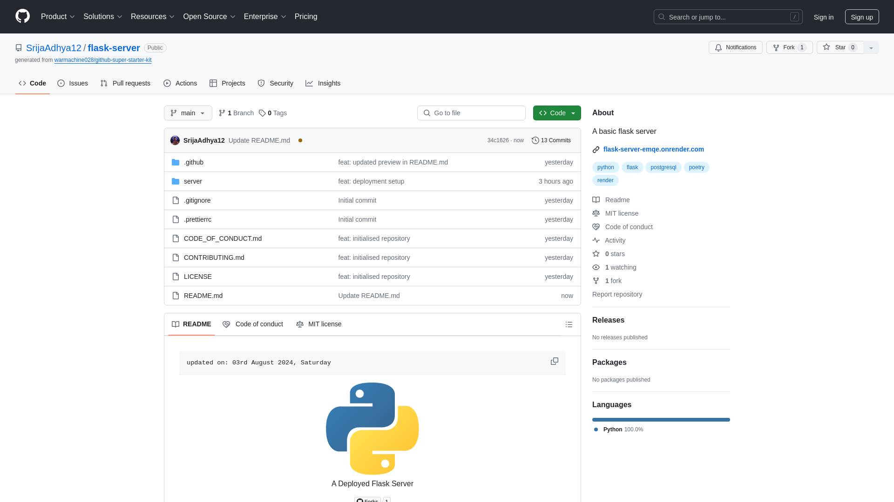

    updated on: 25th June 2025, Wednesday

<div align=center>
    <a href="https://github.com/SrijaAdhya12/flask-server">
        
    </a>
    <p style="font-family: roboto, calibri; font-size:12pt; font-style:italic"> A Deployed Flask Server </p>
    <a src="https://github.com/SrijaAdhya12/flask-server/forks">
        
    </a>
</div>

# [Flask Server](https://github.com/SrijaAdhya12/flask-server)

![line]

## Table of Contents

- [Introduction](#introduction)
- [Developement](#developement)
- [Tech Stack Used](#tech-stack-used)
- [Preview](#preview)
- [Best Contributors](#best-contributors)
- [License](#license)

![line]

## Introduction

- A Flask Server with authentication routes.
- It has Database connection with postgresql.

## Developement

```sh
> poetry install
> flask run 
```

![line]

## Tech Stack Used

- Python
- Flask
- Poetry
- JWT
- Postgresql
- Github
- Render

       

![line]

## Preview



![line]

## Best Contributors

<div align="center">
    <a href="https://github.com/SrijaAdhya12/flask-server/graphs/contributors">
        
    </a>
</div>

![line]

## License

- See [LICENSE]

**Srija Adhya, 2024**

![line]

## Thank you, everyone 💚

[icons]: https://icons8.com/
[markdown-badges]: https://github.com/Ileriayo/markdown-badges
[line]: https://user-images.githubusercontent.com/75939390/137615281-3a875960-92cc-407f-97fe-fd2319bdb252.png
[License]: https://github.com/SrijaAdhya12/flask-server/blob/main/LICENSE

<!-- 25/06/25 -->
